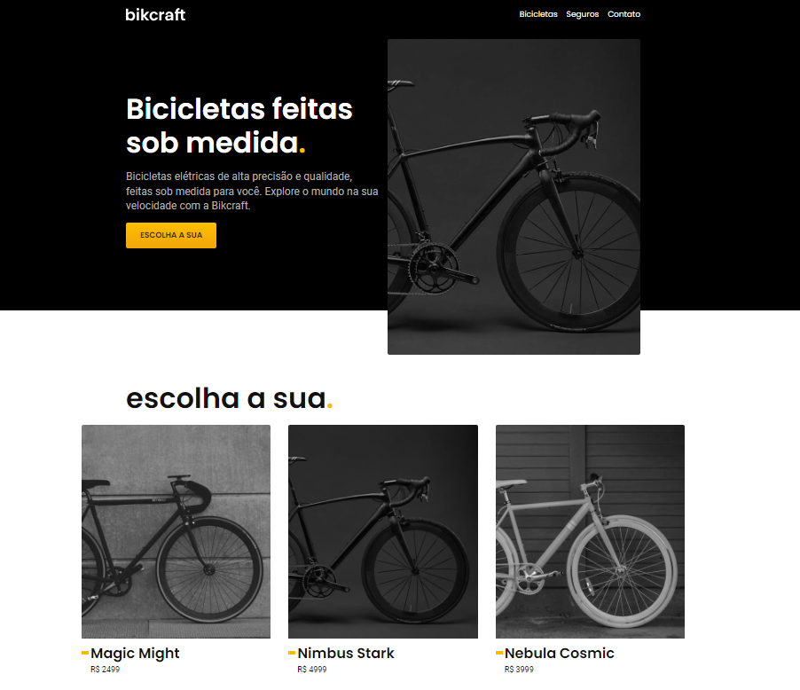

<h1 align="center">🚲 Bikcraft - Origamid</h1>

  Projeto desenvolvido durante o curso <strong>HTML e CSS para Iniciantes</strong> da Origamid.

  

  
  
  
  
  

---

# 📖 Sobre

O **Bikcraft** é o projeto final do curso **HTML e CSS para Iniciantes** da Origamid.

O objetivo do projeto é desenvolver um site completo e responsivo para uma empresa fictícia de bicicletas premium, colocando em prática conceitos fundamentais de HTML5, CSS3 e JavaScript.

Além das funcionalidades propostas pelo curso, implementei melhorias utilizando JavaScript, como um **menu mobile responsivo**, desenvolvido por mim com base nos conhecimentos adquiridos durante os estudos e inspirado na documentação do Bootstrap.

---

# ✨ Funcionalidades

- 🚲 Catálogo de bicicletas
- 📱 Layout totalmente responsivo
- 📸 Galeria de imagens
- ❓ FAQ interativo
- 🎬 Animações na interface
- 📑 Formulários estilizados
- 📋 Páginas institucionais
- 📱 Menu mobile desenvolvido por mim

---

# 🚀 Conteúdos praticados

- ✅ HTML5 Semântico
- ✅ CSS3
- ✅ Flexbox
- ✅ Grid Layout
- ✅ Responsividade
- ✅ Variáveis CSS
- ✅ Pseudo-classes
- ✅ Pseudo-elementos
- ✅ JavaScript
- ✅ Manipulação do DOM
- ✅ Eventos
- ✅ Plugins JavaScript
- ✅ Organização de arquivos
- ✅ Boas práticas de desenvolvimento Front-end

---

# 🛠 Tecnologias

  
  
  

---

# 🎯 Objetivo

Este projeto teve como objetivo consolidar meus conhecimentos em **HTML**, **CSS** e **JavaScript**, desenvolvendo uma aplicação completa e responsiva.

Além dos conteúdos ensinados no curso, aproveitei a oportunidade para criar funcionalidades próprias, colocando em prática a lógica de programação e explorando soluções além do escopo original do projeto.

---

# 🔗 Links

- 🚀 **Deploy:** https://gustavogularte.github.io/projeto-bikcraft/
- 📚 **Projeto original:** https://www.origamid.com/projetos/bikcraft/
- 💼 **LinkedIn:** https://www.linkedin.com/in/gustavo-gularte-arend-58742a286/
- 🌐 **Meu perfil no Frontend Mentor:** https://www.frontendmentor.io/profile/gustavogularte
